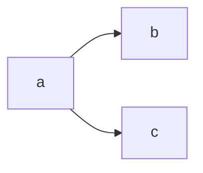

## Hier gehts los

``` swift
func highlightSyntax(swift: String) -> Colors {
	return true
}
```

Ob wir das zum laufen bekommen, ohne wenig Aufwand[^1]?
aber das wird schon klappen.




| Das hier
| ist ein 
| Line block.
|   Wusste gar nicht
|   dass es sowas
| gibt.


> Wie sieht eigentlich ein Zitat aus? [@doe2020]

Aber sieht nice aus, wie [@doe2020] auch findet.

|a|b|c|
|:--|:-:|--:|
|aa|bb|cc|
|aa|cc|bb|
:eine Tabelle

[^1]: Aufwand ist immer ansichtssache.
